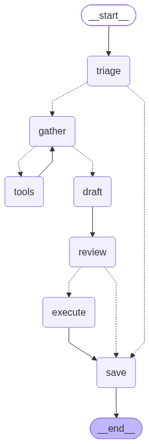

# Триаж обращений в поддержку банка

Проект: агент на LangGraph разбирает обращение клиента «Демобанка», сам находит нужные
данные и правила банка, пишет черновик ответа и предлагает действия. **Выполняет их не он, а код —
и только после того, как оператор нажал «Одобрить».**



## Быстрый старт

```bash
python -m venv .venv && source .venv/bin/activate
pip install -r requirements.txt
cp .env.example .env          # впишите адрес модели и ключ
python -m app.seed            # данные демо-банка
uvicorn app.main:app --reload
```

Откройте http://localhost:8000 — это страница оператора. Кнопка «Новое обращение», примеры, и
дальше видно, что агент делает по шагам.

Нужна Ollama с моделью `bge-m3` (`ollama pull bge-m3`): она считает эмбеддинги для поиска
по правилам. Языковая модель — любой OpenAI-совместимый сервер, адрес в `.env`.

В докере поднимается только сервис, модели остаются снаружи:

```bash
docker compose up --build
```

## Что внутри

**Граф собран руками.** `create_agent` и прочие готовые агенты не используются: узлы и переходы
перечислены явно в `app/agent/graph.py`, из готовых частей взят только `ToolNode`. Так видно,
где принимается каждое решение.

**Человек в контуре — не проверка после, а остановка посередине.** Узел `review` вызывает
`interrupt()`, граф замирает, состояние ложится в SQLite. Оператор может вернуться к обращению
через час — граф продолжится с того же места.

**У модели нет ничего, что меняет данные.** Её четыре инструмента только читают: найти клиента,
посмотреть карты, посмотреть операции, поискать правила банка. Действия она *предлагает*
структурированно, а выполняет их код из `app/db.py` после одобрения.

**Перед оператором действия проверяет код.** `check_actions` отсекает чужие карты, уже
заблокированные карты, просроченные споры и «возврат» того, что комиссией не является.
Оператор видит причину отказа вместо кнопки, которую нельзя нажимать.

**Поиск по правилам** — sqlite-vec: ищем по абзацам, а модели отдаём правило целиком.
Абзац точнее попадает в вопрос, но для ответа нужны все условия и сроки.

## Файлы

```
app/
  main.py        FastAPI: страница, приём обращений
  config.py      настройки из .env
  db.py          база банка: схема, чтение и запись
  seed.py        демо-данные
  rag.py         поиск по правилам банка
  agent/
    graph.py     сборка графа
    nodes.py     узлы и развилки
    tools.py     инструменты модели (только чтение)
    prompts.py   промпты
  web/index.html страница оператора, без сборки
knowledge/policies/  правила банка в Markdown — то, по чему агент ищет
```

## API

| Метод | Путь | Что делает |
|---|---|---|
| `GET` | `/` | страница оператора |
| `POST` | `/tickets` | принимает обращение, стримит шаги агента (SSE) |
| `POST` | `/tickets/{id}/review` | решение оператора, граф продолжается с паузы |
| `GET` | `/tickets` | очередь: ждущие решения первыми |
| `GET` | `/tickets/{id}` | карточка обращения |
| `GET` | `/health` | доступны ли модель, эмбеддинги и база |
